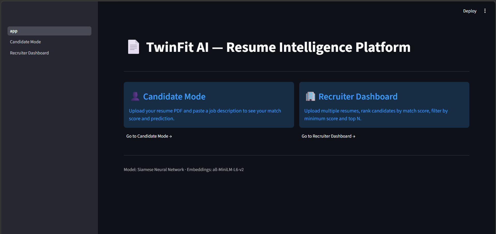
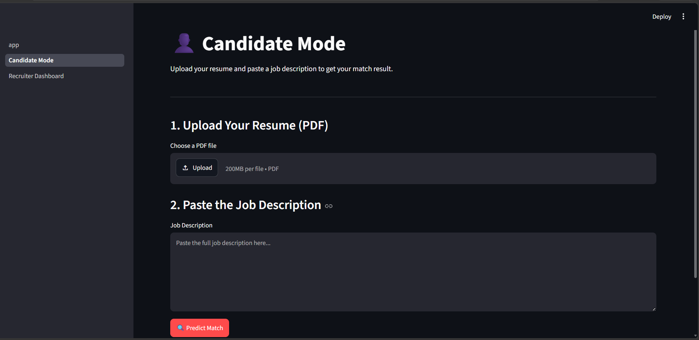
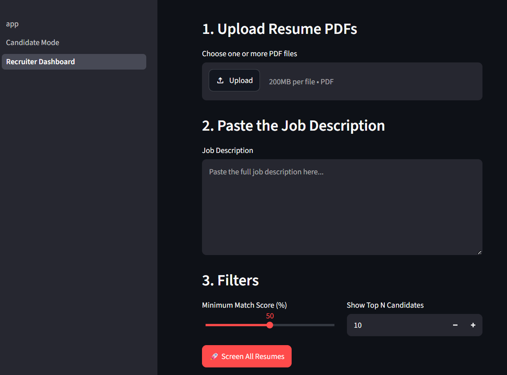
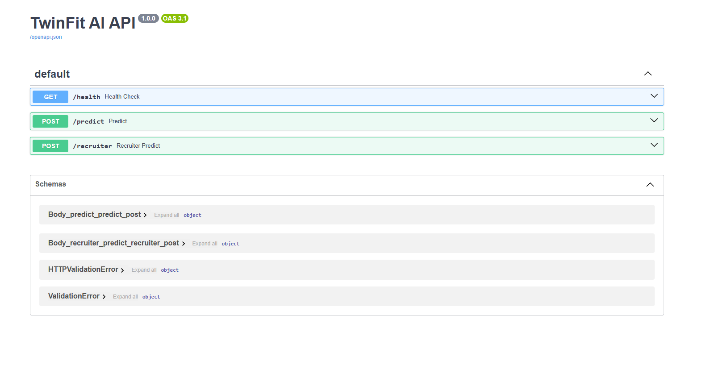

# 📄 TwinFit AI – Resume Intelligence Platform

<p align="center">


</p>

---

## 📌 Overview

TwinFit AI is an AI-powered Resume Intelligence Platform that predicts how well a candidate's resume matches a given Job Description.

Unlike traditional keyword-based resume screening systems, TwinFit AI performs **semantic comparison** using Sentence Transformer embeddings and a **Siamese Neural Network**, enabling it to understand contextual similarity between resumes and job descriptions.

The platform provides two dedicated workflows:

- 👤 Candidate Mode
- 🏢 Recruiter Dashboard

---

# 🚀 Features

## 👤 Candidate Mode

- Upload Resume PDF
- Paste Job Description
- Automatic PDF Parsing
- Resume Text Cleaning
- Semantic Resume Matching
- Match Score Prediction
- Good Fit / No Fit Classification
- Model Confidence Score

---

## 🏢 Recruiter Dashboard

- Upload Multiple Resume PDFs
- Single Job Description
- Automatic Candidate Ranking
- Match Score Filtering
- Top-N Candidate Selection
- CSV Export
- Highest Score
- Average Score
- Qualified Candidate Count

---

# 🧠 AI Pipeline

```text
Resume PDF
      │
      ▼
PDF Text Extraction
(PyMuPDF)
      │
      ▼
Text Cleaning
      │
      ▼
Sentence Transformer
(all-MiniLM-L6-v2)
      │
      ▼
384-D Embeddings
      │
      ▼
Siamese Neural Network
      │
      ▼
Match Probability
      │
      ▼
Good Fit / No Fit
```

---

# 🏢 Recruiter Workflow

```text
Job Description
        │
        ▼
Upload Multiple Resume PDFs
        │
        ▼
Extract Resume Text
        │
        ▼
Generate Embeddings
        │
        ▼
Siamese Neural Network
        │
        ▼
Predict Match Score
        │
        ▼
Rank Candidates
        │
        ▼
Filter by Threshold
        │
        ▼
Top-N Selection
```

---

# 🏗 Model Architecture

```text
Resume
      │
Sentence Transformer
      │
Resume Embedding
      │
      │
      ▼
Siamese Neural Network
      ▲
      │
JD Embedding
      │
Sentence Transformer
      │
Job Description
```

The Siamese Neural Network uses **shared weights** to learn semantic similarity between resume embeddings and job description embeddings.

---

# ⚙️ Tech Stack

| Category | Technology |
|-----------|------------|
| Language | Python |
| Deep Learning | TensorFlow, Keras |
| NLP | Sentence Transformers |
| Embedding Model | all-MiniLM-L6-v2 |
| Backend | FastAPI |
| Frontend | Streamlit |
| PDF Parsing | PyMuPDF |
| Data Processing | Pandas, NumPy |
| Machine Learning | Scikit-learn |

---

# 📂 Project Structure

```text
TwinFit-AI/

│
├── app.py
├── api.py
│
├── pages/
│   ├── 1_Candidate_Mode.py
│   └── 2_Recruiter_Dashboard.py
│
├── src/
│   ├── preprocessing/
│   │   ├── parser.py
│   │   ├── clean_txt.py
│   │   └── preprocessing_pipeline.py
│   │
│   ├── models/
│   │   ├── simennes.py
│   │   ├── train.py
│   │   ├── predict.py
│   │   └── custom_layers.py
│   │
│   ├── recruiter/
│   │   └── bulk_screening.py
│   │
│   └── embeddings/
│       └── embeb_pipeline.py
│
├── saved_models/
│
├── outputs/
│
└── requirements.txt
```

---

# 🌐 REST API

## Health Check

```
GET /health
```

Returns API status.

---

## Candidate Prediction

```
POST /predict
```

Input

- Resume PDF
- Job Description

Output

```json
{
  "match_score": 91.2,
  "prediction": "Good Fit"
}
```

---

## Recruiter Screening

```
POST /recruiter
```

Input

- Multiple Resume PDFs
- Job Description

Output

```json
[
  {
    "rank": 1,
    "name": "John Doe",
    "score": 94.8,
    "prediction": "Good Fit"
  }
]
```

---

# 📊 Model Performance

Binary Classification

| Metric | Value |
|---------|------:|
| Accuracy | **91%** |
| Precision | **95% (No Fit)** |
| Recall | **91% (Good Fit)** |
| Weighted F1 Score | **0.91** |

---

# 🖥️ Application Screenshots

## 🏠 Home Page



---

## 👤 Candidate Mode



---

## 🏢 Recruiter Dashboard



---

## 📡 FastAPI Documentation



---

# ▶️ Installation

Clone the repository

```bash
git clone https://github.com/jainab-bee/TwinFit-AI.git
cd TwinFit-AI
```

Install dependencies

```bash
pip install -r requirements.txt
```

Run FastAPI

```bash
uvicorn api:app --reload
```

Run Streamlit

```bash
streamlit run app.py
```

---

# 💡 Why TwinFit AI?

Traditional ATS systems primarily rely on keyword matching, often overlooking resumes that are contextually relevant but use different terminology.

TwinFit AI addresses this limitation by leveraging Sentence Transformer embeddings and a Siamese Neural Network to perform semantic resume-job matching. The platform supports both candidate self-evaluation and recruiter-side bulk resume screening through a unified AI pipeline.

---

# 🔮 Future Scope

- Semantic Skill Gap Analysis
- ATS Resume Score
- Resume Improvement Suggestions
- Resume Strength & Weakness Analysis
- Docker Deployment
- PDF Report Generation

---

# 👩‍💻 Author

**Jainab Bee**

B.Tech Computer Science & Engineering (Artificial Intelligence)

Passionate about AI, Deep Learning, NLP, and Full-Stack AI Applications.

---

## ⭐ If you find this project useful, consider giving it a Star!
